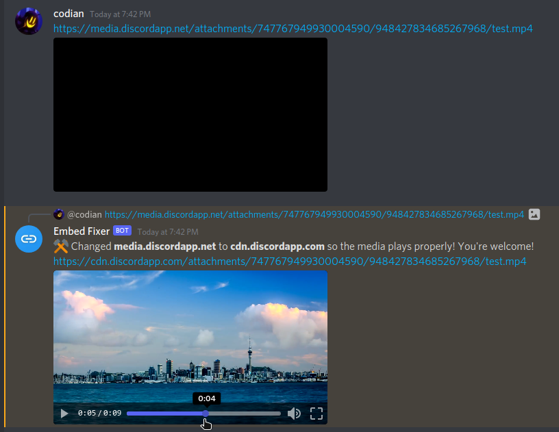

# 🔗 Embed Fixer ⚡
A tiny Discord bot that fixes embeds &amp; video players for media.discordapp.net URLs by redirecting them to the Discord CDN.

# [👉 Click to add to your Discord server!](https://discord.com/api/oauth2/authorize?client_id=948506066281463828&permissions=11264&scope=bot)

## What does it do?
Discord has this really annoying issue where if you copy the link of some particular videos, the resulting URL is addressed at `media.discordapp.net` instead of `cdn.discordapp.com`, and as a result the video does not play.

This is a simple Discord bot that fixes the URL and replies with the fixed link, so the video can be viewed without the user having to manipulate the link.

## Check it out!

